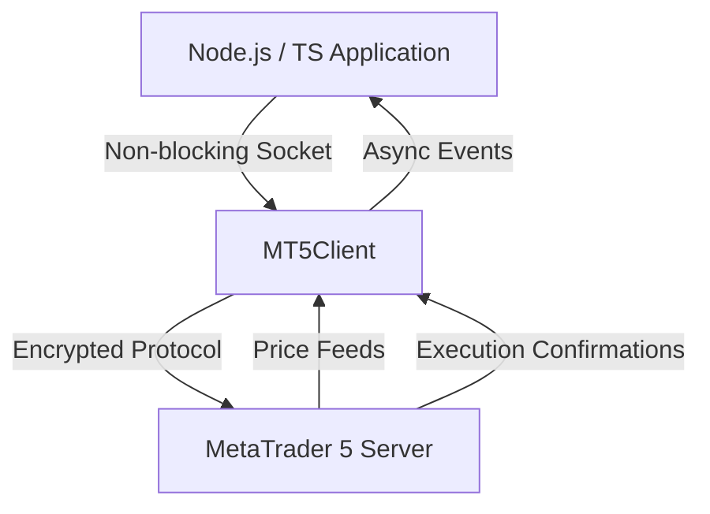

# NodeMT5 SDK

Welcome to the **NodeMT5 SDK** documentation. This high-performance Node.js and TypeScript library connects directly to MetaTrader 5 servers to execute trades, manage open positions, query account balance and margin, and stream real-time price quotes.

## Key Features

- **TypeScript Native**: Full typing support for compile-time safety across all requests, orders, and market events.
- **Event-Driven Streaming**: Real-time tick quotes and market depth via reactive callbacks and EventEmitter.
- **Order Execution**: Complete MT5 trade operations including market orders, pending orders, and partial closes.
- **Async/Await API**: Idiomatic modern JavaScript Promises for clean asynchronous workflows.

## Architecture



## Quick Installation

```bash
npm install @metarpc/nodemt5
```

Or with Yarn / pnpm:

```bash
yarn add @metarpc/nodemt5
# or
pnpm add @metarpc/nodemt5
```

Next, check out the [Getting Started](getting-started.md) guide to build your first trading script.
